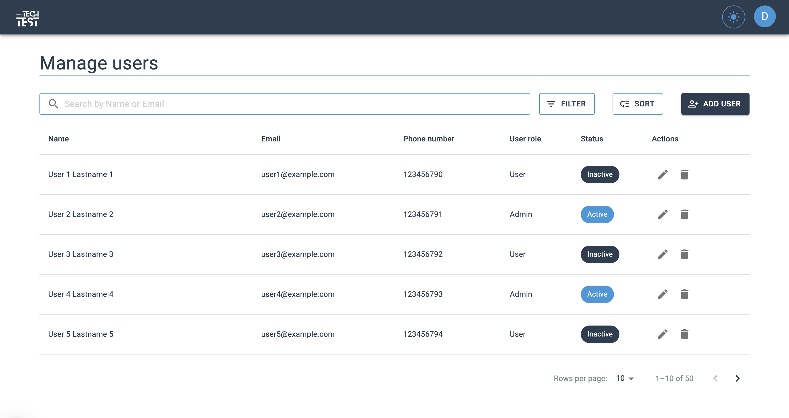

# Gestión de usuarios - Proyecto Next.js

Este proyecto es una aplicación web desarrollada con Next.js, con un enfoque en la experiencia del usuario por su diseño intuitivo y simple. A continuación, se detallan los aspectos clave del proyecto, cómo configurarlo y ejecutarlo, así como los desafíos enfrentados durante su desarrollo.

&nbsp;

## Tecnologías y herramientas Utilizadas


&nbsp;

## Configuración y Ejecución del Proyecto

1.  **Clonar el repositorio**:

    ```
    git clone https://github.com/dianariosramirez/managment-users-react.git

    cd managment-users-react
    ```

2.  **Instalar dependencias**:
    ```
    npm install
    ```
3.  **Configurar variables de entorno**:

    - Crear un archivo `.env` en la raíz del proyecto.
    - Añadir la API KEY de Google Maps:

    ```
    NEXT_PUBLIC_GOOGLE_MAPS_API_KEY=tu_api_key_aquí

    ```

4.  **Ejecutar el proyecto**:
    ```
    npm run dev
    ```

&nbsp;
&nbsp;

## Implementación y desiciones

### Inicio del Proyecto

Se inició el proyecto con Next.js debido a la recomendaciòn de la documentaciòn de React para inicializar un proyecto. Además, Next.js también ofrece un sistema de enrutamiento basado en archivos, lo que simplifica la estructura del proyecto.

### Material UI

Se utilizó Material UI como librería de estilos debido a su amplia gama de componentes preconstruidos y su facilidad para personalizar los mismos. Esto permitió una implementación rápida de una interfaz de usuario en el desarrollo.

### Google Maps

Para la implementación de un mapa de Google Maps, se utilizó la librería @react-google-maps/api. Se configuró una API KEY gratuita con límites de uso, lo que es suficiente para las necesidades del proyecto. La implementación incluyó la creación de un componente GoogleMap, junto con un Marker para obtener las coordenadas.

### Diseño

Se optó por un diseño minimalista con una paleta de colores basada en azul. Se simuló una barra de navegación con un logo y un perfil de usuario. La tabla de datos se implementó utilizando componentes básicos de Material UI, con filtros en un popover que utiliza selectores, entre otros componentes.

### Manejo de Datos

Para manejar grandes cantidades de datos de manera eficiente, se simuló la implementación de paginación del lado del servidor. Esto permite cargar solo los datos necesarios para la página actual (en este caso en la tabla), por lo tanto se reduce el tiempo de carga.
Se optó por esta opción debido a la posible necesidad de manejar grandes cantidades de datos de manera eficiente y reducir la carga inicial en el cliente. Pues, aunque la virtualización ofrece una navegación más fluida, la paginación del lado del servidor proporciona una mejor escalabilidad y un menor uso de memoria, lo que es crucial para aplicaciones con gran volumen de datos.

### Zustand

Se utilizó Zustand por su simplicidad y eficiencia en comparación con otras soluciones de gestión de estado. Se usó para manejar el estado global de la aplicación, específicamente para alternar entre modos claro y oscuro.

&nbsp;

## Desafíos y Soluciones

### Implementación de Google Maps

La obtención y configuración de la API KEY de Google Maps fue un desafío inicial. Además, hubo dificultades para integrar el mapa en la aplicación de manera eficiente. Para solucionarlo, se investigó la documentación oficial de la api y se siguió un tutorial para obtener la API KEY. Luego, se utilizó la librería @react-google-maps/api para integrar el mapa en la aplicación, lo que simplificó el proceso.

### Error de Hidratación en Next.js

Durante el desarrollo, se encontró un error de hidratación en Next.js, que detuvo el progreso del proyecto. Se investigó el error y se descubrió que era causado por una discrepancia entre el HTML renderizado en el servidor y el HTML renderizado en el cliente. Se solucionó reorganizando los componentes y modificando la generación de usuarios aleatorios para asegurar que el HTML fuera consistente.

### Configuración de la Paleta de Colores

Hubo dificultades en la aplicación consistente de los temas de Material UI, especialmente en la alternancia entre modos claro y oscuro. Para resolverlo, se especificaron los colores en cada componente necesario y se utilizó Zustand para manejar el estado global del tema.

&nbsp;

## Vista principal de la UI del proyecto

https://managment-users-react-test.vercel.app/



## &nbsp;

¡Gracias por revisar mi proyecto! Para cualquier pregunta o feedback, no dudes en contactarme.
